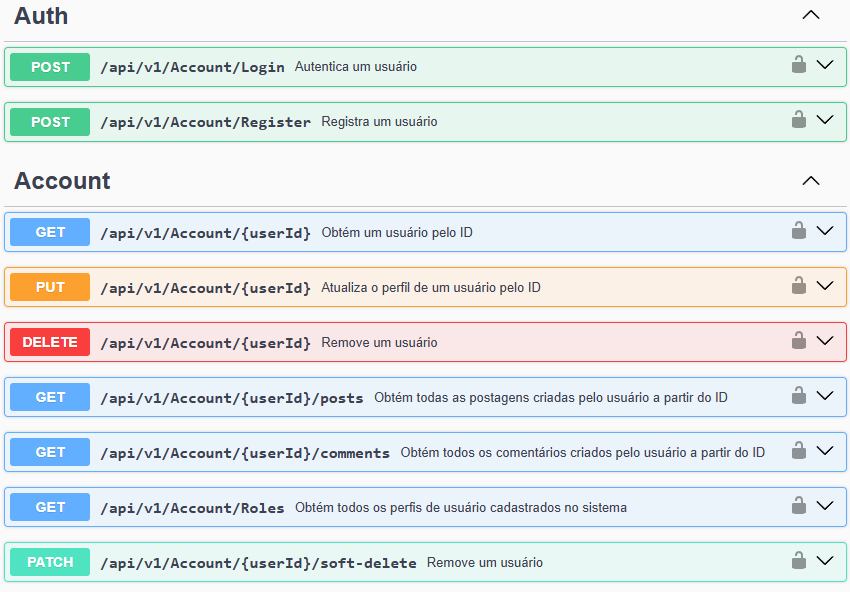

<h1 align="center">
  <br>
  <b>Blog API</b>
  <br>
</h1>

<p align="center">
  <a href="#sobre">Sobre</a> •
  <a href="#tecnologias">Tecnologias</a> •
  <a href="#fundamentos">Fundamentos</a> •
  <a href="#licença">Licença</a>
</p>

<div align="center">
  
</div>

## Sobre

Este projeto foi desenvolvido com o intuito de exercitar a arquitetura em três camadas (API, BLL e DAL) e o design de banco de dados. A API para blog permite que os usuários cadastrem posts, adicionem comentários e utilizem tags para organizar o conteúdo.

O projeto adota boas práticas, como injeção de dependências, separação de responsabilidades e padronização de código. Além disso, ele está preparado para ser executado em um ambiente dockerizado, garantindo maior portabilidade e facilidade de implantação.

## Informações Técnicas

### Tecnologias

Este projeto utiliza as seguintes ferramentas e tecnologias:

- **.NET 9** – Framework principal para o desenvolvimento da API.
- **Entity Framework Core** – ORM para acesso a dados e modelagem do banco.
- **FluentValidation** – Biblioteca para validação de dados.
- **AutoMapper** – Mapeamento automático entre modelos e DTOs.
- **Swagger (Swashbuckle)** – Documentação interativa da API.
- **Serilog** – Logging estruturado e armazenamento de logs.
- **Docker** – Contêinerização para facilitar implantação e escalabilidade

### Fundamentos

#### Arquitetura

O projeto segue a arquitetura de três camadas (Three-Tier Architecture):

- **API Layer:** Camada de apresentação, responsável por expor os endpoints da API.
- **Business Logic Layer (BLL):** Camada de regras de negócio, onde os serviços e validações são implementados.
- **Data Access Layer (DAL):** Camada de persistência, que interage com o banco de dados via Entity Framework.

#### Design do Banco de Dados

O banco de dados foi projetado para suportar um sistema de blog, englobando as seguintes entidades principais:

- **Usuário:** Cadastro de usuários com autenticação e permissões.
- **Post:** Publicação de artigos no blog.
- **Comentário:** Sistema de feedback para os posts.
- **Tag:** Organização do conteúdo por categorias.

## Como Rodar

### 1. Preparação

Para clonar este repositório, você precisará ter o [Git](https://git-scm.com) e a versão adequada do .NET instalada em sua máquina.


### 2. **Executando a Aplicação**  

A aplicação pode ser executada pela interface do Visual Studio ou no modo debug no VS Code.  

- **Via Visual Studio:** Abra a solução e execute com **Docker Compose**.  
- **Via Terminal:** Execute os comandos apropriados para iniciar a aplicação.  

#### **Rodando com Docker Compose**  

- Para subir os containers:  

```sh
docker-compose -f docker-compose.yml -f docker-compose.override.yml up -d
```

- Para parar os containers:  

```sh
docker-compose down
```

### **Credenciais de Teste**  

- **Usuário Admin**  
  - Email: `admin@example.com`  
  - Senha: `Admin@123`  

- **Usuário Padrão**  
  - Email: `guest@example.com`  
  - Senha: `Guest@123`  

## Licença  

Este projeto é licenciado sob a licença **MIT**.
